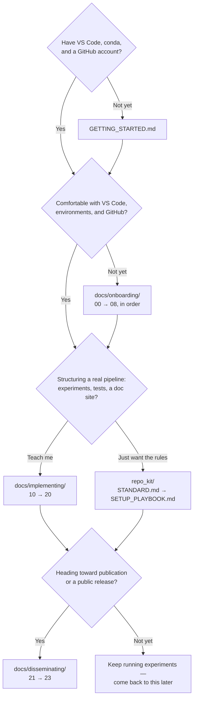

# research-software-field-guide

The goal of this repo is to provide a resource to (wetlab) scientists who are performing an increasing amount of code-driven data analysis. Keeping a record of the steps taken to analyze data is as important to keeping a detailed record of how data is acquired. Whether the experiments involve running simulations, exploring data analysis and data presentation approaches, or developing, testing, and implementing involved data processing pipelines, keeping an effective record of the experimental premise, process, and results will make you a more efficient and effective scientist. This guide and its templates are intended to onboard scientists to some standard coding tools, introduce some CS jargon and best practices, provide a framework for documenting data exploration and pipeline development, and outline important steps to disseminating results and new analytical tools. It is written with the assumption that many scientists will pursue increasingly sophisticated code-driven analyses using AI coding assistants to speed the process; these AI coders will handle many details of code structure and syntax, while the scientist must retain scientific leadership as well as responsibility for the integrity of the process and the data interpretation. In that context, the guide docs are written to be human-facing overviews, while the portable standard (`repo_kit/`) has templates and instructions to help the scientist and their AI assistants initiate new projects or update an existing research repository to the same practices.

The structure and standard that this repo teaches is summarized in `repo_kit/STANDARD.md`.

## Where to start...

If you need to start from scratch, go to [GETTING_STARTED.md](GETTING_STARTED.md) to install the tools (VS Code, miniconda), make a GitHub account, and clone the repository.

If you have the tools, but need more background on how to use VS Code, environments, and GitHub best practices, read through the onboarding guide in `docs/`. Start at [00_python_code_basics.md](docs/onboarding/00_python_code_basics.md) and work up; they are numbered in reading order. Quick-look refreshers on jargon, hotkeys, and tips can be found in `reference/` notes.

If you're comfortable working in VS Code and making regular commits to GitHub, then the series of documents discussing how to implement a scientific workflow (`docs/implementing`) may be helpful for setting up a structured repo for both exploratory analysis and keeping a record of larger data analysis runs and results. Start with [10_from_scripts_to_pipelines.md](docs/implementing/10_from_scripts_to_pipelines.md).

If your repo is looking good and you want to be able to share your results more easily using an autodoc website (private or public), check out ['20_documentation_and_doc_sites.md'](docs/implementing/20_documentation_and_doc_sites.md).

If your project is ready for publishing and/or you have code that you want to make publicly installable for others to use as well, then read the notes on disseminating your work, starting with [`21_packaging.md`](docs/disseminating/21_packaging.md).

If you are ready to start a new repo or update an existing repo with this structure and documentation standard, then go to the `repo_kit` folder; read the `README.md` and `STANDARD.md`, then follow the steps in the `SETUP_PLAYBOOK.md`.

## Origin and credits

This guide began as Allison Dennis's response to the curriculum for the [URSSI Responsible Research Software Development summer school, June 2026](https://github.com/si2-urssi/summerschool-June2026). It was then substantially expanded as training material for the Dennis Lab, and has since grown into a general-purpose resource for any researcher writing analytical software. Written by Allison Dennis with Claude and Claude Code.