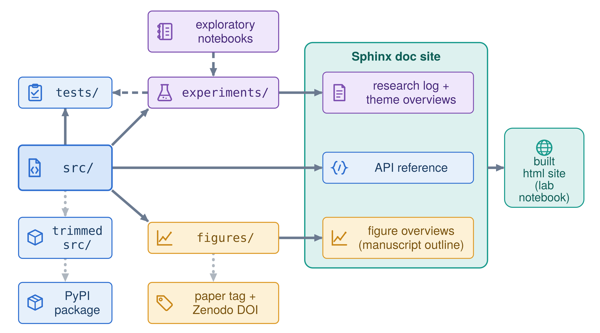

# research-software-field-guide documentation

## What are we doing here?

Increasingly, scientists and students are able to access complex computational analysis using AI coding
assistants. Accelerating scientific discovery via **vibe coding** is great, but we are still each
independently responsible for our own scientific output, the repeatability of our results, and the
responsible development of research software.

In that context, this repo intends to give the non-computer scientist a framework and tutorial on how to
(vibe) code their science rigorously, ensure the repeatability of their experiments, and be able to
automatically turn their code outputs and analysis into a website for accessible viewing — to facilitate
discussion of the results (even with a non-coder) and archiving.

Regardless of whether a human or AI assistant is doing the bulk of the coding, it's critical that you
maintain control of the scientific questions being asked, can follow the code generated, verify it does
what you actually asked, and run it yourself. The coding standards and habits taught here, and enforced
later on, exist for that same reason regardless of who typed the code: they let you, a reviewer, or
future you tell whether a result is actually correct, not just plausible-looking.
[18_ai_assisted_development.md](implementing/18_ai_assisted_development.md) and
[ai_coding_assistants.md](reference/ai_coding_assistants.md) cover working with an assistant directly,
once you're doing that on real work.

## How this guide is organized

The **onboarding track** (docs 00–09) takes a newcomer from near-zero software experience to confident
contributor. Read those in order; they build on each other and define every term on first use. Doc 09 is
a hands-on exercise to do once you have read the rest.

The **implementing track** (docs 10–20) covers the next tier: intermediate research-software engineering
for when scripts grow into real pipelines and research projects. When a project is actually headed for
publication, the separate **disseminating track** (docs 21–23) picks up from there.

The **reference docs** are for later. Skim the list once so you know what's there, then come back as
needed.

If you are already an experienced developer and just want to apply this standard to a repository, the
[`repo_kit/`](../repo_kit/) folder at the repository root is a portable kit for exactly that: setting up
a new repo, or bringing an existing one up to standard.

## How your repo gets organized

Once a repo adopts this guide's structure, every new line of inquiry follows the same shape: a
dedicated, undated folder for the question, a research log tracking what's settled and what's still
open, and dated runs underneath recording what each attempt actually did. The diagram below shows how
those pieces — `src/`, `experiments/`, `tests/`, and the doc site — fit together once a repo has grown
into this shape.

<!-- TODO: add the repo-structure flowchart here once it exists, e.g.:

-->

[repo_kit/STANDARD.md](repo_kit/standard.md#the-structure) shows the same shape as a file tree, and
[example_repo_structure.md](reference/example_repo_structure.md) walks a fully worked-out instance of
it, if you'd rather see it filled in than read it in the abstract.

## Before you start

The onboarding docs assume VS Code, Git, and conda are installed and that you have already cloned the repository. If that is not yet true, work through [GETTING_STARTED.md](root/getting_started.md) (`GETTING_STARTED.md` at the repository root) first — it is the from-scratch setup sheet that gets you to an open workspace.

## Full table of contents

Every doc in the guide — onboarding, implementing, disseminating, and reference — in reading order,
with a one-line summary of what it covers, is in the [table of contents](table_of_contents.md).
