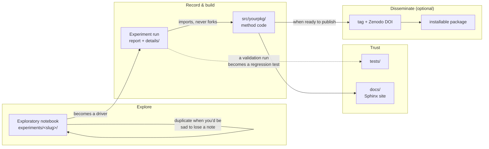

# A standard for research code, in brief

This is the short read for a scientist who already codes and does not want to walk a full tutorial. It
states the **goal**, the **repository structure**, and the **decisions** (with the reasoning) behind a
research codebase that stays reproducible, well-documented, and efficient to explore in. Each decision
links to the implementing-track doc that teaches it in depth, for when you want the long version.

If you want a machine to *apply* this to a repo — scaffold a new one, or upgrade an existing one — hand
your coding agent [SETUP_PLAYBOOK.md](SETUP_PLAYBOOK.md). This file is the *why*; that one is the *how*.

## What this is for

Your repository is, first and foremost, a **research notebook**: a place to explore data and record
what you did and what you found, so the whole line of inquiry stays reproducible and legible — to a
collaborator, a reviewer, or future-you — without anyone having to reconstruct it from the `git log`. Structure and
documentation here are not bureaucracy. They make the *exploration itself* faster and more trustworthy:
you spend less time rediscovering what you already tried, and you can believe your own results.

A second job appears later, and only for some projects. As results head toward publication, the same
repo can also yield **a tagged version of the code for public release to support a publication** and/or **a library others can install and use** — pared down to the validated methods you choose to disseminate. Many projects never need this, and that is fine. The standard's core move is to let an experimental repo grow into that second job *without either job corroding the other*, while never forcing it on a project that remains exploratory.

Underneath both: **tools may assist with the coding, you do the science.** Linters, formatters, tests, doc
generators, and AI assistants accelerate the mechanical work; designing experiments, assessing results, and drawing conclusions stay with you. Everything below exists to make your scientific judgment reproducible and reviewable, not to replace it.

## The structure

A repo built to this standard will gradually grow toward this shape (names are conventional, not mandatory). You do
not need all of it at once — a folder of scripts and a notebook is a fine start, and you add pieces (a
package, tests, a doc site, CI) as the work earns them. A full pipeline repo with experiment tracking will be structured like this:

```
your_repo/
├── experiments/             question-driven studies — your reproducible research notebook
│   ├── README.md            the research log: goal, open questions, decisions (read this first)
│   ├── _TEMPLATE.md         copy it to start a new theme
│   ├── _common/             shared harness (run logging, comparison plots, reporting) — never method code
│   └── <theme-slug>/        one undated, permanent folder per theme (hyphens allowed — a multi-word
│                              theme name reads better hyphenated; revisited for as long as that
│                              line of inquiry stays open): its README, driver(s), and
│                              - <YYMMDD_slug>[_NN].md (or .ipynb)   dated run reports, readable at a glance
│                              - details/<YYMMDD_slug>[_NN]/   the manifest/metrics/figures behind
│                                each report, name-matched to it, rarely opened directly
├── src/yourpkg/             your method code — the importable library; studies import from here and never copy it
├── tests/                   pytest suite (unit + regression), seeded from validation experiments
├── docs/                    Sphinx site: a browsable, always-current record generated from docstrings,
│                              plus rendered experiment reports:
│                              - experiment_overviews/<theme>_overview.md   one per theme, includes its
│                                README and a toctree of that theme's reports
│                              - experiment_summaries/*.md   the reports themselves (hand-authored and/or
│                                promoted run stubs), flat so a glob toctree can pick them up
├── CLAUDE.md                coding standards, read by humans and the AI every session
├── references.md            the reference ledger: external sources + why each mattered here
├── .claude/experiments_playbook.md   how this repo runs and records experiments
├── config / local_paths.py  parameters and machine-local data paths (paths stay out of git)
└── pyproject.toml           declares the package, once the code is worth installing
```

The [implementing track](../docs/implementing/) walks the whole progression, from a first script to this
shape.

## The decisions, and why

**The repo is your lab notebook: state and provenance are recorded, so that your process and results are consistently documented.** A top-level **research log** (`experiments/README.md`) holds the goal,
the status of every open question, what's next, and a dated decision log, so the project's state and history is
presented with a focus on the scientific goals, hypotheses, and tests. Each run writes a small **manifest** (git commit + dirty flag,
parameters, which data, a checksum) plus metrics and a short report; the scientist's *interpretation* of
each run is at the top of the experiment run report in a protected section that AI assistants never overwrite. The code structure ensures that the results are recorded; you write what
they mean. A `dirty` flag records whether the tracked code was committed when a run executed; a run you
keep is *finalized* by re-running it on committed code, so its manifest points at a clean commit anyone can
check out and reproduce. A root-level **reference ledger** (`references.md`) completes the record: it pairs each
external source the work builds on with *why it mattered here*, kept current as you go so the
manuscript's methods and bibliography are accrued rather than reconstructed at write-up.
→ [16_running_a_dry_lab_experiment.md](../docs/implementing/16_running_a_dry_lab_experiment.md)

**Look at the data at every step, and document as you explore.** Before you have a test for every step,
*manual data examination* is the sanity check: generate and show the intermediate outputs — arrays, distributions, residuals —
not only the final number, and watch how each step changes them. Docstrings, short run reports, and a
readable research log are what turn a scattered exploration into a notebook you can actually navigate
next month. Good documentation here pays off during the work, not just at write-up. A run's report can
be a `.md` file or a Jupyter notebook — a notebook that already carries a top-cell what/why and an
observed note *is* the report; there's no separate write-up step to duplicate it into markdown.
→ [16_running_a_dry_lab_experiment.md](../docs/implementing/16_running_a_dry_lab_experiment.md)

**Data stays out of git; runs reference it by a stable identifier.** Real datasets live on a server or
drive and are named by a machine-local root (kept in a git-ignored `local_paths.py`) or by a DOI, with a
checksum pinning *which* data a run used. The one carve-out is for small, curated datasets — a few frames or
rows — that a test or tutorial actually needs.
→ [17_working_with_large_data.md](../docs/implementing/17_working_with_large_data.md), [CLAUDE.template.md](CLAUDE.template.md)

**Method code lives in `src/`; experiments are thin drivers that use it, never forking it.** The
importable `src/` library holds the actual analysis code — including several competing approaches while
you are still deciding between them, so they can be compared side by side without drift. An experiment
is a short driver that imports the library and the `_common/` harness, feeds them particular inputs, and
records what happened; it contains *no method code of its own*. That is what keeps a comparison honest:
the experiment tests exactly the code the library provides. `_common/` holds only scaffolding — run
logging, comparison plots, report embedding — not a (drifting) copy of a method.
→ [15_experiments_and_shipping.md](../docs/implementing/15_experiments_and_shipping.md)

**Tests plus CI are the safety net that lets you change code fearlessly.** A test that pins a known-good
number catches the silent regression a refactor or a dependency bump would otherwise hide; a validation
experiment, once you trust it, *becomes* a regression test. Continuous integration reruns those checks on
a clean machine on every push, catching "works on my machine" fails before they reach `main`.
→ [12_testing_with_pytest.md](../docs/implementing/12_testing_with_pytest.md),
[14_continuous_integration.md](../docs/implementing/14_continuous_integration.md)

**Docstrings become a browsable Sphinx site.** A generated site turns the docstrings you already write
into a reference you can read — useful for your own navigation during exploration, and a way for a
reviewer to grasp the shape of an analysis at the module level without reading every line. It cannot
drift from the code because it *is* the docstrings. Use NumPy-style docstrings; Sphinx is the
scientific-Python norm (NumPy, SciPy, pandas all use it).
→ [20_documentation_and_doc_sites.md](../docs/implementing/20_documentation_and_doc_sites.md)

**Instructions are split into three files so no one file sprawls.** A research repo keeps three kinds of
written guidance, and mixing them is what turns a guide into an unreadable pile:
- **State** — the research log (`experiments/README.md`): what you found, what's next. For humans; is updated each session.
- **Durable procedure** — `.claude/experiments_playbook.md`: describes how the repo runs and records experiments. For the AI, mostly.
- **Standards** — `CLAUDE.md`: coding conventions, applied to human- and AI-written code alike.

→ [18_ai_assisted_development.md](../docs/implementing/18_ai_assisted_development.md)

**Even if AI writes code, you do the science — and a clean run is not a correct analysis.** An AI assistant can read
the standards file and produce conforming code fast, but it clears "does it run" effortlessly and can
miss "does it run the analysis I want" entirely. So review every generated change like a colleague's
pull request, never trust a number without a test, and validate beyond the test using a known-good case,
physical plausibility, an independent method, and the intermediate outputs. The more you delegate to your AI assistant, the more scrutiny your results will need.
→ [18_ai_assisted_development.md](../docs/implementing/18_ai_assisted_development.md)

**If and when a project reaches publication, the experiments become the figure pipeline — then you
freeze it.** Up to here nothing forces a "final" state. When results are publication-ready, the experiment
runs are what generate the figures; you then **tag** the exact state behind the paper (with every
compared approach still present), archive that tag for a permanent **DOI** (Zenodo), and add a `LICENSE`
and `CITATION.cff`. Only after freezing do you trim `src/` on `main` down to the one approach you
disseminate — if disseminating a clean library is even a goal. The tag keeps the paper reproducible;
`main` keeps moving. A tag is not a fork: it costs nothing and cannot rot.
→ [23_concluding_a_project.md](../docs/disseminating/23_concluding_a_project.md),
[15_experiments_and_shipping.md](../docs/implementing/15_experiments_and_shipping.md)

## How it fits together



Nothing above forces you further right than the project needs: a folder of scripts and a notebook is a
complete, valid state to stay in. Every arrow is a *decision*, not a requirement — the "why" for each
one is in the bullets above.

## Adopting it

- **New repo?** Hand Claude [SETUP_PLAYBOOK.md](SETUP_PLAYBOOK.md) and follow the scaffold sequence —
  but start with only what you need (a research log and your experiments); formalize the `src/` package,
  tests, a doc site, and CI as the work earns them.
- **Existing repo?** Same playbook, à la carte — pick the upgrade recipe you need (add a research log,
  add tests, add a doc site, restructure to `src/` + `experiments/`, …).
- **Just want the rules?** [CLAUDE.template.md](CLAUDE.template.md) is the standing coding standard; copy
  it in, fill the placeholders, and the assistant follows it every session.

The full, worked tutorial behind every decision above is the research-software-field-guide
[implementing track](../docs/implementing/) (docs 10–20) plus, once a project is headed for
publication, the [disseminating track](../docs/disseminating/) (docs 21–23). This page is its
executive summary.
